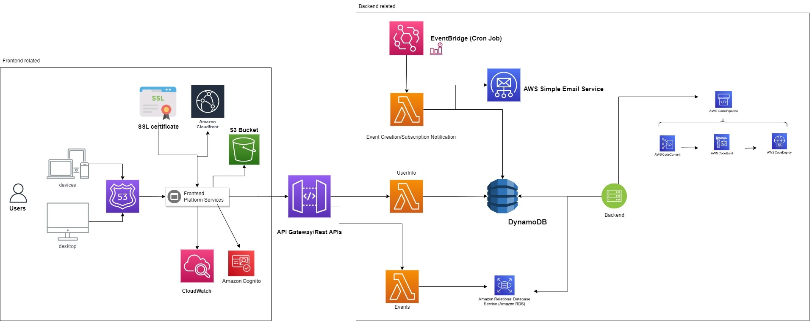

# EventGen - A serverless application
### A multi-user application that lets users create events and view events that their friends have created.

  

<h3 align="center">
  EventGen main page designed with React.js  
</h2>
 

## Project Details
* EventGen is a modern, serverless social networking application built with AWS microservices for the backend and a React frontend.
* The React framework was used to create a fast and responsive user interface, while an AWS-supported backend provided a scalable and serverless application.
* The application could be accessed at https://serverless-eventgen.link/
  * Note: The link has been disabled due to operational AWS costs.

## Technologies

* **Frontend-related technologies:**
  * React.js
  * Bootstrap
  * Material-UI
  * CSS
  * AWS Cognito
  * Route 53
  * Monitoring services
  * S3 bucket (code uploaded here)
* **Backend-related technologies:**
  * AWS API Gateway 
  * Lambda functions
  * EventBridge (cron job)
  * AWS Simple Email Service (SES)
  * DynamoDB
  * Amazon Relational Database service (RDS)
  * AWS CodePipeline (AWS CodeCommit, CodeBuild, CodeDeploy)

## Architecture Diagram

  

<h3 align="center">
  EventGen's frontend and backend is connected with AWS API Gateway 
</h2>

## Features
* Authorization (sign up, log in, log out)
* Create events
* Search for events
* RSVP to events
* "Like" events
* View event details
* Search for friends
* Add friends
* Receive email notifications

## Credits
* Collaborated in a team of 8 as part of a final project for a Serverless Computing & Microservices course.
* Revised template from: https://github.com/ThantZinPhyo-OP/Digital-Marketing-Web
  * Note: The author removed public viewing of this link as noticed on Jan. 5, 2023.