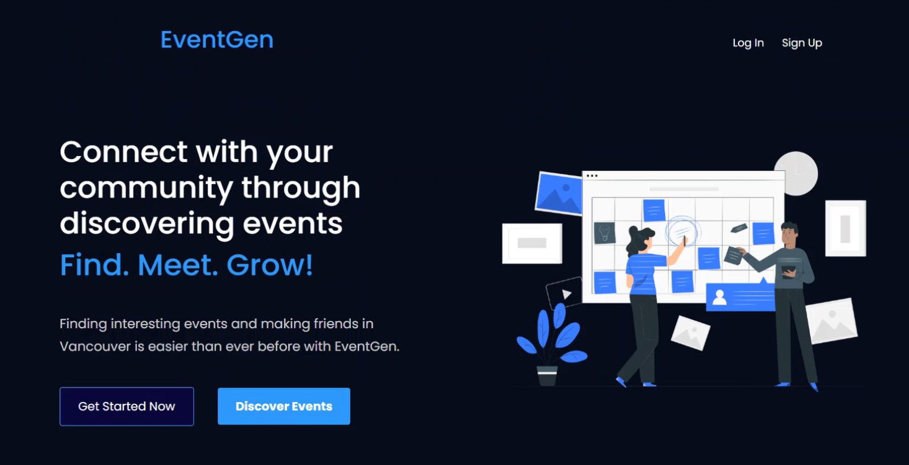

# EventGen - A serverless application
### A multiuser application that lets users create events and view events that their friends have created.

  

<h3 align="center">
  EventGen main page designed with React.js  
</h2>
 

## Project Details
* EventGen is a modern, serverless social networking application built with AWS microservices for the backend and a React frontend.
* The React framework was used to create a fast and responsive user interface, while an AWS-supported backend provided a scalable and serverless application.

## Technologies

* Frontend built with:
  * React.js
  * Bootstrap
  * Material-UI
  * CSS
  * AWS Cognito
  * Route 53

* Backend built with:
  * Lambda functions

## Features

* Add events

## Credits
* Collaborated in a team of 8 as part of a final project for a Serverless Computing & Microservices course.
* Revised template from: https://github.com/ThantZinPhyo-OP/Digital-Marketing-Web
  * Note: the author removed public viewing of this link as noticed on Jan. 5, 2023

